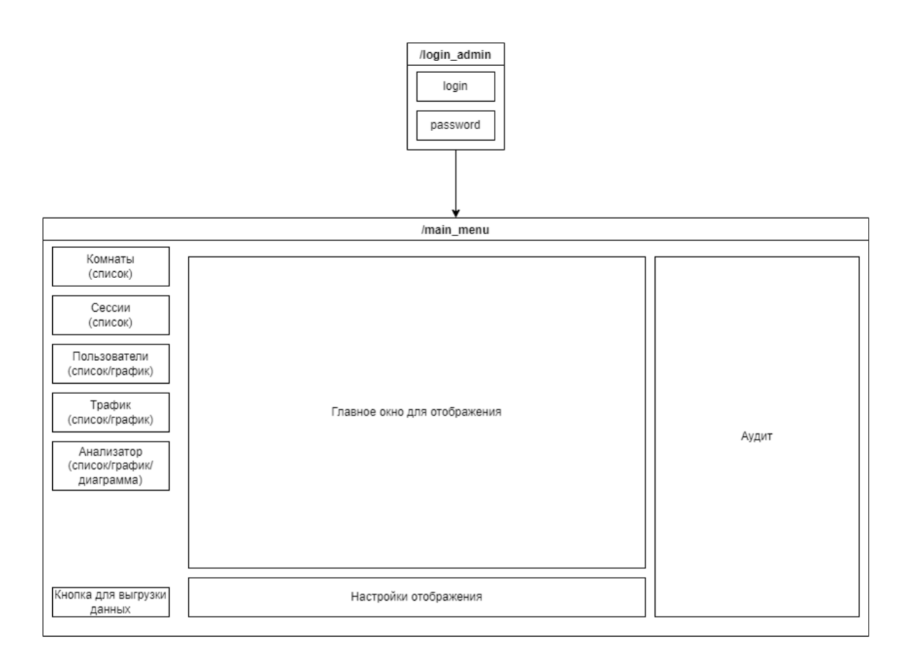

# Админ панель

Админка построена на двух окнах – вход и главное меню. Схема для меню примерная,
но отображет минимальный фукнционал будущей админки. Списки данных либо
графики отображаются в ГЛАВНОМ ОКНЕ, а аудит предназначен для обновляемых
логов по данным. Пояснения ниже.

## Основные функции
1) Комнаты – представляются списком всех комнат, которые на данный момент
активны. В аудит при этом идет информация по типу “создана комната Н, игроки Н,
время Т”, “удалена комната К, конец игры время Т, победитель П, режим Р” и тд. К
комнатам можно подключаться, можно удалять игроков, вмешиваться в действие игры
2) Сессии – список всех активных сессий на данный момент. В аудит льется
информация о сессиях. Можно отключать сессию
3) Пользователи – список всех пользователей, которые есть в системе. Причем по
умолчанию отображены пользователи активные, но можно запросить неактивных
пользователей, или иная фильтрация. В аудит льется информация по типу
“пользователь П сделал шаг Ш, позиция П”. График рисует активность пользователей
за какой-либо промежуток времени. Можно банить или удалять пользователей
4) Трафик – в моем понимании это нечто похожее на wireshark, но вместо данных
о типе передачи будет показаны данные об игроке, комнате, сессии. Как и в wireshark,
можно отсмотреть данные, которые были отправлены или получены. Поддержка фильтрации по ключевым словам (их будет немного, чтоб не сильно жирный
   функционал был для игрушки). В случае с графиком можно показать скорости,
   количество передаваемых пакетов и тд
5) Анализатор – сюда выносится анализ ошибок, возраста игроков, частоты
выбора того или иного режима.
Внизу имеется кнопка для выгрузки данных. Поддерживается два формата: json и
excel.

Сразу стоит отметить, что бэкенд будет завязан в основном под отправку и прием
HTTP-запросов. Не стоит пихать бизнес-логику, она вся уже есть на сервере, задача
админки только принимать и отправлять http.
Http-запросы (отправка – отправляются админкой, приме – принимаются админкой)
1) `/login_admin` – отправляется админкой, внутри вложены хэддеры (логин и
пароль), токен админа
2) `/room_data` – отправка админкой
3) `/room_audit` - прием
4) `/room_info` -отправка
5) `/room_connect` - отправка
6) `/room_action` - отправка
7) `/room_delete` - отправка
8) `/sessions_data`- отправка
9) `/session_audit` - прием
10) `/session_info` - отправка
11) `/session_delete` - отправка
12) `/users_data` - отправка
13) `/users_audit` - прием
14) `/user_info` -отправка
15) `/user_ban` - отправка
16) `/user_delete` - отправка
17) `/trafic_data` - отправка
18) `/analysis` -отправка
19) `/download_json` - отправка
20) `/download_excel` - отправка