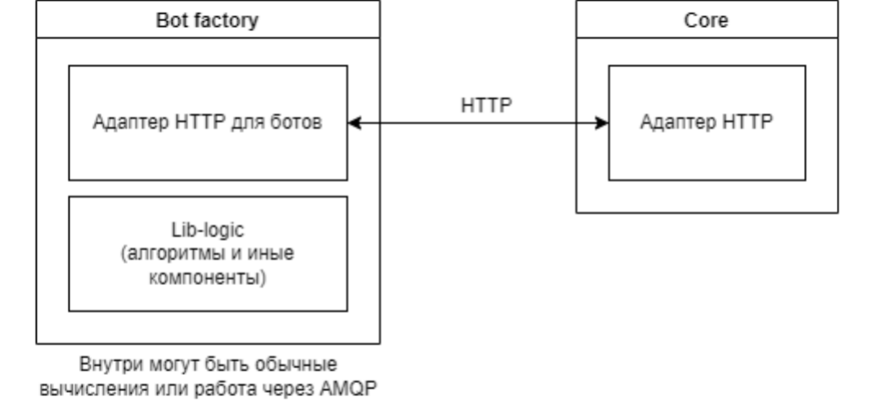

# Фабрика ботов

## Ориентировочная схема взаимодействия сервера приложений и фабрики ботов

При этом подразумевается, что начало работы бота провоцируется сервером
приложений, а не бот-фабрикой.

### Последовательность действий:
1) Сервер приложений обращается к серверу с бот-фабрикой по Http, отправляя
запрос для активации нужного ему бота
2) Бот активируется и подтверждает свою работоспособность. Подтверждение
происходит за счет уникального для бота токена и его отправки на запрос
сервера приложений
3) Бот считается активным до тех пор, пока сервер приложений не отправит HTTP
с просьбой дезактивации бота
4) Пока бот активен, он получает HTTP-запросы с ходами игроков, строит свою
модель игры и на основе модели просчитывает дальнейшие ходы. При
дезактивации бота бот не реагирует на запросы сервера приложений

### Получаемые фабрикой запросы:
1) `/initialize` - get-запрос, внутри которого лежит айди бота, нужного для активации
2) `/data_info` - post-запрос с данными о ходе игры и айди бота
3) `/what_bot_do` - get-запрос с айди бота
4) `/deinstall` - get-запрос с айди бота, которого нужно деактивировать

### Отправляемые фабрикой запросы:
1) `/login` - post-запрос с айди бота в хэддере и с уникальным бот-токеном
2) `/error_bot` - get-запрос с айди бота, который говорит, что что-то пошло не так с
работой бота
3) `/exit_bot` - post-запрос с айди бота и токеном, который уведомляет об
отключении бота

