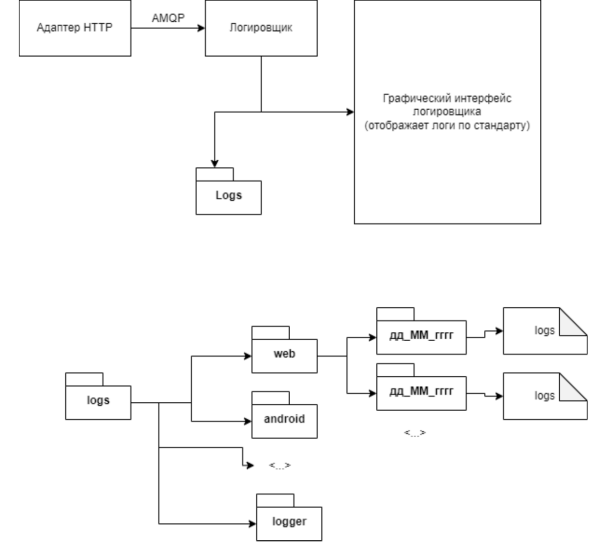
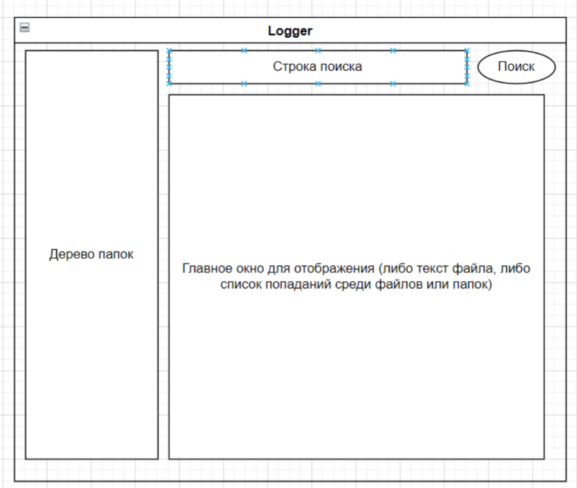

# Логи

## Примерная схема работы логировщика:



## Требования
1) Должна быть поднята очередь RabbitMQ. Параметры очереди - Direct Exchange,
queue_name “logging”
2) Очередь принимает Json с рядом параметров
3) После обработки Json программа либо создает в папке для логов
определенного приложения папку с датой (если нет таковой) либо
перезаписывает в имеющейся папке логи в файл с именем logs.log
4) Если запускается графический интерфейс, он условно выглядит как файловый
проводник, но при этом дает возможность читать логи в самом интерфейсе.
Также интерфейс предусматривает поиск данных по папкам, файлам и
содержимому файла. Запрещается давать доступ на редакцию логов

Json-пример
```json
{
"name_app": "adapter_http",
"time": "12:34:57 12_09_2022",
"logs": "some_logs_big_text_you_know?"
```

Логеру будут приходить:
1) имя приложения, которое пишет логи
2) время, в которое были записаны логи
3) сами логи. Огромный текст.


## Список названий папок для каждого из приложений
1) `web` - папка для логов веб-фронта
2) `android` - папка для андроид-приложения
3) `bot_factory` - папка для бот-фабрики
4) `admin_metric` - папка для админки
5) `adapter_http` - папка для http-адаптера
6) `adapter_database` - папка для адаптера базы данных
7) `business_logic` - папка для бизнес-логики
8) `docs_gen` - папка для документатора
9) `logger` - папка для логов самого логгера :)

Структура папок представлена на схеме выше. Предполагается, что на сервере есть
папка `logs`, внутри которой лежат 9 перечисленных выше папок, в каждой из этих папок
лежат папки с датами (название = дата, на которую шла запись логов), внутри этих
папок лежат файлы с логами. У всех файлов название `logs.log`

## Графический интерфейс

Примерная схема интерфейса представлена ниже
