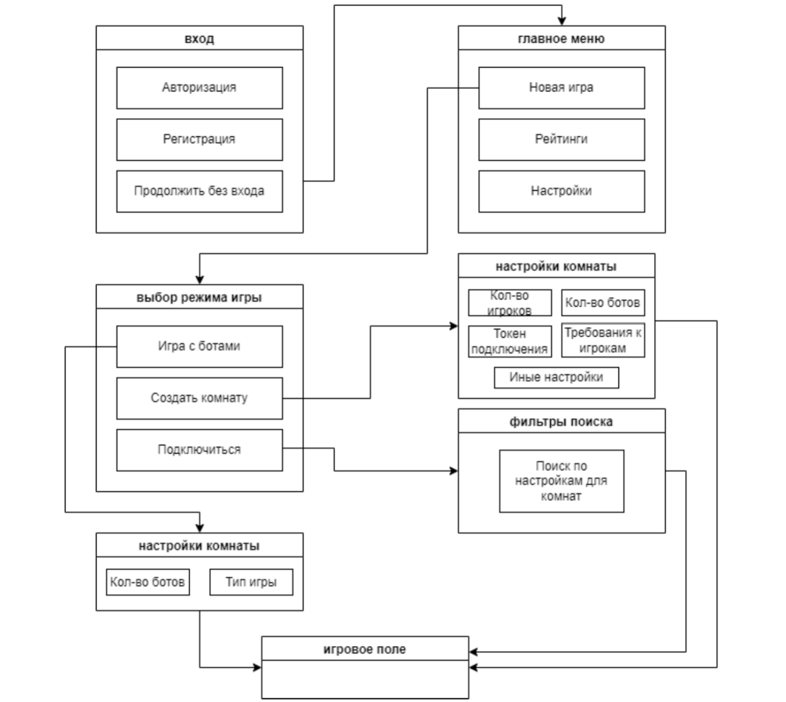

# Web и Андройд приложения


## Схема страниц с фронта




### Страницы:
1) вход
2) главное меню
3) выбор режима
   - настройки комнаты
   - фильтр поиска игроков
4) игровое поле


## Описание дизайна

1) Общее фоновое решение будет выполнено в цвете `#CAE8E5` (кроме игрового
поля)
2) Кнопки могут быть выполнены либо в цвете `#369E94` , либо в цвете фона и
быть выделены с помощью цвета `#369E94`
3) Шрифт всего текста должен быть выполнен в стиле **SK Primo** (может не стоять
на ПК, поэтому загрузите из инета в проект, чтобы поставлялся с самим
приложением)
4) Некликабельный текст будет выполнен в цветах `#E9C8B6` или белом, для
кнопок также может быть белый, на темных кнопках `#E9C8B6` , на светлый
кнопках черный или `#9E5E3C`
5) Поля ввода должны быть белыми, неправильно введенные данные могут быть
помечены `#E99C9B` либо оставаться белыми, но сбоку от поля быть помечены
каким-либо знаком (например, красный восклицательный знак при вводе
неверного логина или пароля)
6) Другие цвета должны быть подобраны под выше представленную палитру в
рамках сплит-комплементарной цветовой схеме
7) Игровое поле представляет из себя классическое игровое поле Монополии,
поэтому тут цветовые стандарты заданы самой игрой
    


## Описание работы каждой страницы

### Вход

Вход представляет из себя три варианта входа: пользователь может либо
авторизоваться, либо быстро зарегистрироваться (окно регистрации требует
отдельного разговора с фронтами, не особо его представляю), либо продолжить игру
без регистрации. Соответственно, пользователь имеющийся в базе и пользователь
без регистрации имеют разный приоритет: пользователь без регистрации не участвует
в рейтингах, его настройки не сохраняются, а зарегистрированные пользователи могут
отказаться играть с незарегистрированными пользователями. Все запросы на этапе
входа будут POST

Если говорить об авторизованных пользователях, то при проверке введенных данных
приложение отсылает HTTP-запрос(`/login`), а именно json-файл с данными:
1) `headers` - сюда вшиты логин и пароль
2) `botToken` - токен бота, который у пользователя будет всегда равен одному
значению 42notBot42

Пример такого json
```json
{
"headers": "123H456",
"botToken": "42notBot42"
}
```

Если говорить о регистрации(/login), то приложение отсылает json с данными:
1) `userName` - имя игрока
2) `headers` - логин и пароль
3) `email`
4) `botToken`

Пример JSON
```json
{
"userName": "stas123",
"headers": "123U:456",
"email": "aaa@aaa.aaa",
"botToken": "42notBot42"
}
```
Если говорить о пользователях без регистрации, то приложение отсылает json с
данными(`/login`):
1) `isAnon: true`
2) `botToken`

Пример такого json:
```json
{
"isAnon": true,
"botToken": "42notBot42"
}
```
Ответ на такой запрос сервер вернет рандомный идентификатор пользователя:
`randomId` - автоматически сгенерированный идентификатор, состоящий из латиницы
строчных и заглавных букв, цифр и спец.символов, длина 32 

Идентификатор будет лежать в json-файле.

### Главное меню

В главном меню будут доступны три кнопки: начать игру, рейтинги среди игроков, и
настройки. Настройки должны быть доступны только у зарегистрированных
пользователей, у незарегистрированных настройки не меняются (либо имеют
ограниченных функционал, здесь нам нужно будет договориться). Под настройками я
понимаю звук, мелодии, аватарки, темы, кастомы и тд. Рейтинги также будут доступны
только зарегистрированным пользователям, поскольку незареганным данная
информация ни к чему. Ну или рейтинги будут доступны, но будут выглядеть как-то
иначе - на усмотрение фронтов (об этом также можно договориться).

Настройки хранятся на устройстве, а не в БД.
Для рейтингов будет отсылаться только один запрос: `/top_100`.
В ответ сервер будет присылать топ 100 лучших игроков в монополии.
Кнопка “Начать игру” перемещает на страницу с выбором режимов игры.

### Выбор режима

Пока что из всех очевидных для меня режимов являются три: игра с ботами, игра с
игроками в своей комнате и игра с игроками в чужой комнате. Игра подразумевает три
типа развития: игра на время, игра до 1 или 2 банкротов или игра до первого
монополиста
При выборе первого режима игрок может выбрать количество ботов и тип игры (выше
написала). В таком случае отправляется HTTP-запрос с параметрами:
1) `countOfPlayer` - количество игроков от 2 до 6
2) `modeOfGame` - botMode
3) `typeOfGame` - тип игры, возможные значения: timer (игра на время),
one_bankrupt (до первого банкрота), two_bankrupt (до второго банкрота),
monopolism (до первого монополиста)
Пример json-файла:
```json
{
"countOfPlayer": 4,
"modeOfGame": "botMode",
"typeOfGame": "one_bankrupt"
}
```
Если игрок выбрал режим “Создать комнату”, то количество настроек увеличивается.
Параметры:
1) `countOfPlayer` - количество игроков от 2 до 6
2) `modeOfGame` - myRoom
3) `typeOfGame` - тип игры, возможные значения: timer (игра на время),
one_bankrupt (до первого банкрота), two_bankrupt (до второго банкрота),
monopolism (до первого монополиста)
4) `haveToken` - true/false
5) `token`: сам токен/0 - 8 символов
6) `mustRegistr`: true/false - должны ли игроки быть зарегистрированы
7) `haveBots`: true/false
8) `countOfBots`: от 2 до n-2, где n - количество игроков (как минимум, в игре должно
быть два реальных игрока)
(если будут предложения по параметрам, обсудим)
Пример json:
```json
{
"countOfPlayer": 4,
"modeOfGame": "myRoom",
"typeOfGame": "one_bankrupt",
"haveToken": true,
"token": "78f45r98",
"mustRegistr": false,
"haveBots": false,
"countOfBots": 2
}
```